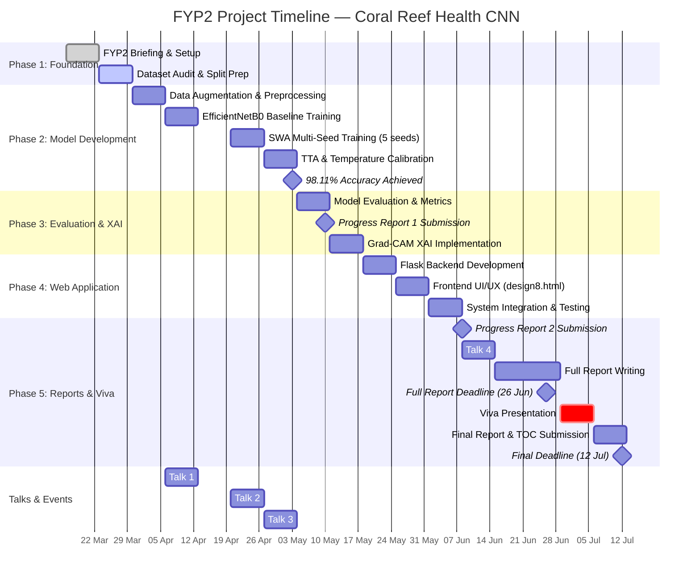
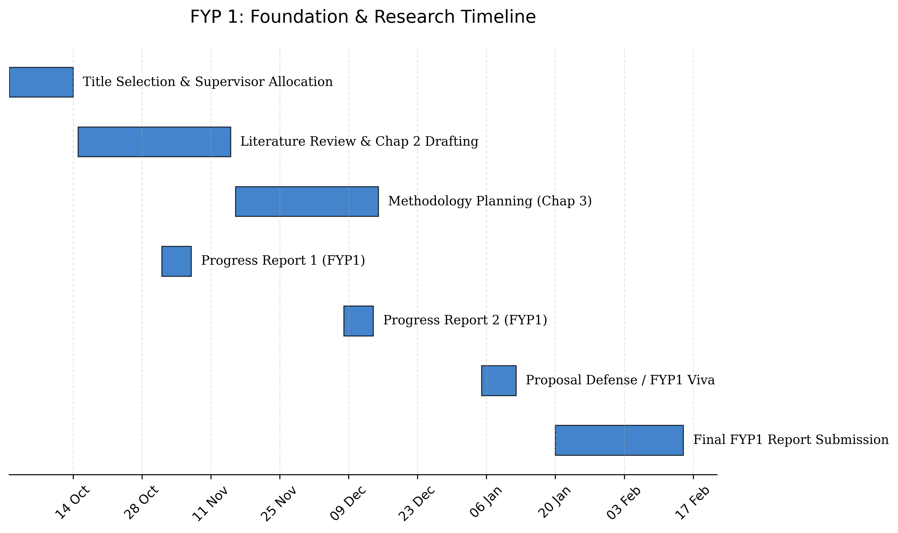
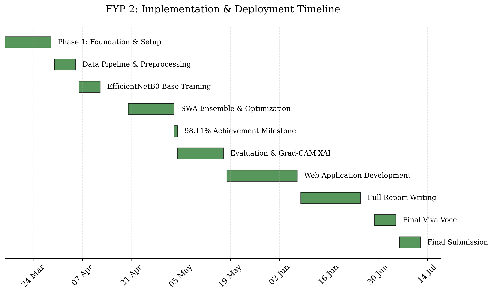

# FYP2 Gantt Chart — Coral Reef Health Assessment
## via Convolutional Neural Network-based Image Analysis

**Supervisor:** Assoc. Prof. Ts. Dr. Yasmin Yacob  
**Duration:** Week 1 (16 Mar 2026) → Week 18 (19 Jul 2026)

---

## FYP2 Development Timeline

---

## Key Milestones

| Date | Milestone |
|------|-----------|
| 16 Mar 2026 | FYP2 Briefing |
| 03 May 2026 | **98.11% Ensemble Accuracy Achieved** |
| 10 May 2026 | Progress Report 1 Submission |
| 08 Jun 2026 | Progress Report 2 Submission |
| 26 Jun 2026 | Full Report Submission Deadline |
| 29 Jun – 05 Jul 2026 | Viva Voce Presentation |
| 12 Jul 2026 | Final Report & TOC Submission |

---

## Phase Breakdown

### Phase 1 — Foundation & Review (Week 1–2)
- FYP2 briefing attendance
- Project re-orientation & FYP1 feedback review
- Environment setup (Python, TensorFlow, CUDA)
- Dataset audit & deterministic split creation

### Phase 2 — Model Development (Week 3–6)
- Data pipeline: OpenCV preprocessing (224×224, BGR→RGB)
- Hard-example oversampling (×20 for Bleached/Dead)
- EfficientNetB0 transfer learning baseline
- **Stochastic Weight Averaging (SWA)** — 5-seed ensemble (42–46)
- **Multi-Scale Test-Time Augmentation (TTA)** — 224+256, flip
- **Temperature Scaling** (T=0.441)
- **Final Achievement: 98.11% ensemble accuracy**

### Phase 3 — Evaluation & Explainability (Week 7–8)
- Confusion matrix & classification report
- Per-class metrics: Healthy (F1=0.99), Bleached (F1=0.98), Dead (F1=0.97)
- **Grad-CAM** explainability with JET colormap
- Per-image audit verification

### Phase 4 — Web Application (Week 9–11)
- Flask backend with inference API
- Professional landing page (design8.html)
- Interactive "Try Model" with drag-and-drop upload
- Grad-CAM overlay visualization in browser
- `run_coral_ai.bat` launcher

### Phase 5 — Reports & Viva (Week 12–18)
- Progress Report 2 submission
- Full report writing (all chapters)
- Viva presentation (slides + live demo)
- Final report & TOC submission

---

---

## FYP 1: Foundation & Research Visual

---

## FYP 2: Implementation & Deployment Visual

*Latest Version: 2 April 2026*  
*Generated via custom Matplotlib script*
