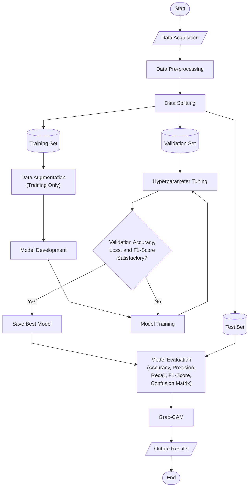

# Methodology Flowchart Mermaid

This file stores the final detailed methodology flowchart selected for the report.

## Notes

- This is the final chosen detailed flowchart for the report.
- The separate simple block diagram is used as the summary diagram, while this flowchart shows the training, validation, tuning, and evaluation logic in more detail.
- `Data Augmentation` is applied only to the training set after splitting.
- `Validation Set` is used for hyperparameter tuning and for checking validation accuracy, loss, and F1-score.
- `Test Set` is reserved for the final evaluation stage.
